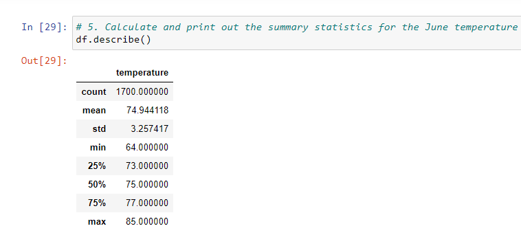
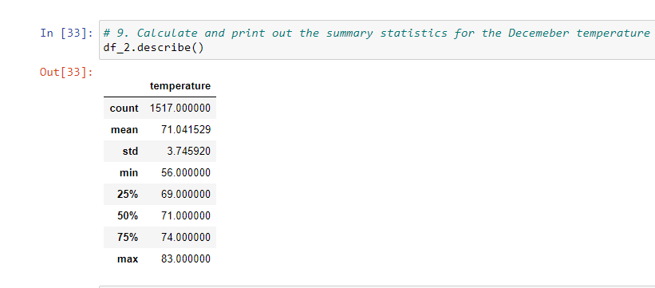

# surfs_up

## Overview

##### This analysis seeks to determine the extent of the temperature difference that may exist between the warmest and coldest months of the year at Oahu with a view to determining the viability of a Surf and Ice-Cream shop all year round.

## Results

* There is less than 4 point difference between the mean temperatures in June and December of 74.9 deg and 71.0 deg respectively.
* There's only a 2-point difference between the Maximum temperatures of June and December as shown in the table.
* There's only 3 point difference between the 75 percentile of the June and December temperatures.

## Summary

The results of this analysis shows that December, presumably the coldest month at Oahu, is about as warm as June, the warmest month. This implies that Oahu should attract tourist all year round. Some additional queries we could include in this analysis are:
* Precipitation statistics for both June and December at Oahu.
* A determination of the spread of stations where the data was obtained to gauge the reliability of the results.